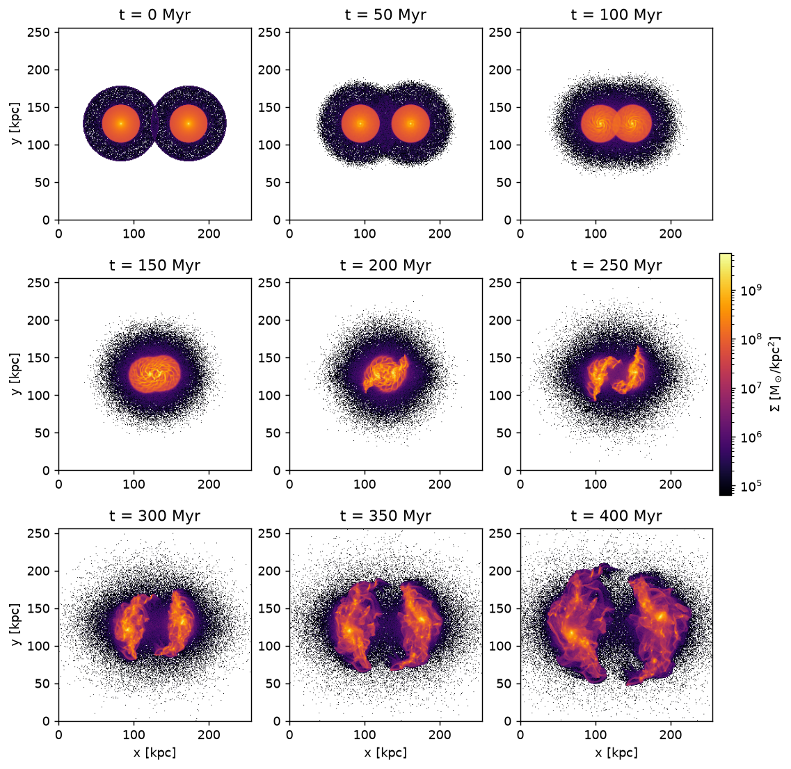
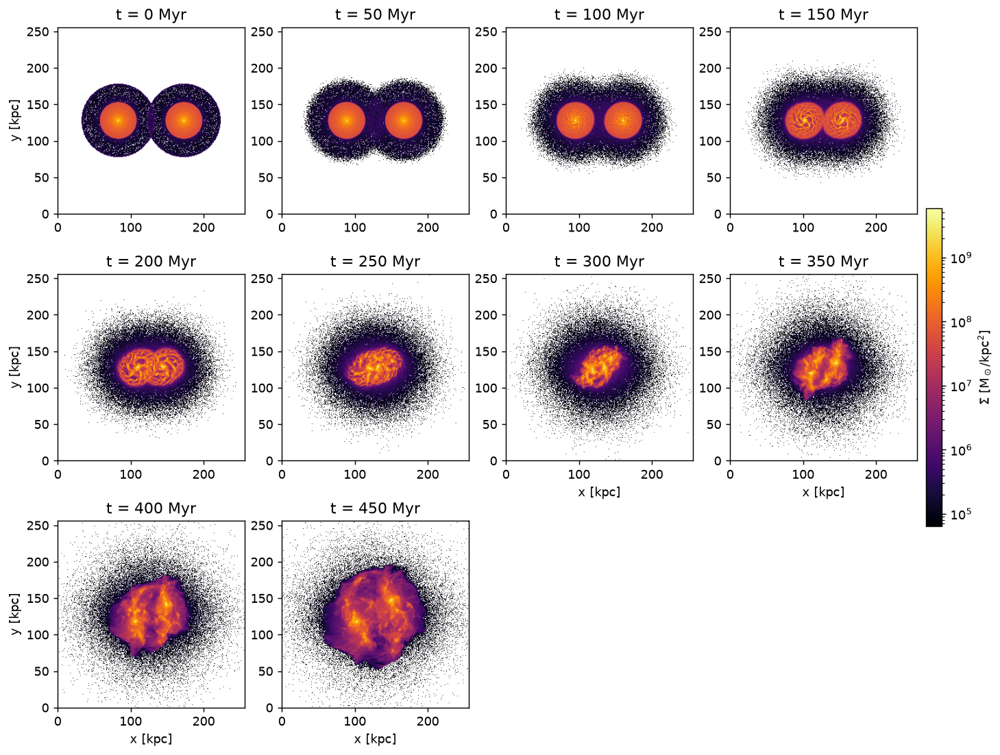
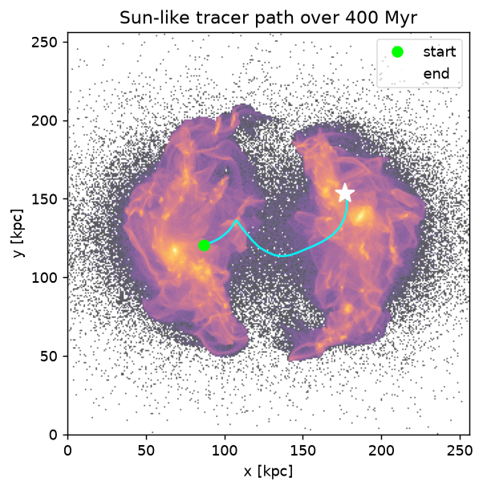
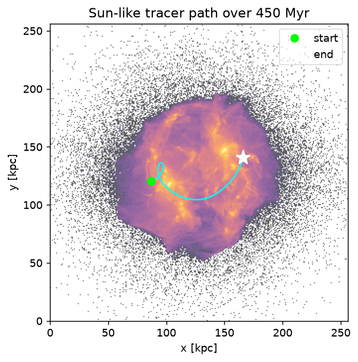

# Paper reproduction (Stage 4 / 4C)

Reproduction of the headline visuals from the 2020 PHYD57 paper *Galaxy Collisions With CUDA
and FFT* (Adams, Lajevardi, LeBlanc, Movaseghi) on the modernized PM engine: the **4v** and
**2v** Milky-Way × Andromeda collisions and the **Sun-like tracer** path.

> **This is a *qualitative* reproduction.** The gross collision outcome and the 4v↔2v contrast
> match the paper, but at 10M particles / 1 kpc cells the cold disks heat substantially, so the
> detailed morphology is *illustrative*, not high-fidelity, and there is no validated energy
> conservation at this scale. See **Validation bar** and **Caveats** below before reading the
> figures as physics.

## How to regenerate

```bash
paper-repro --config configs/paper_4v.yaml   # 4v run -> docs/figures/*_two_galaxy_4v.png
paper-repro --config configs/paper_2v.yaml   # 2v run -> docs/figures/*_two_galaxy_2v.png
```

Each run is a 256³ grid (1 kpc³ cells), **10M particles**, the portable open-BC **multigrid**
solver, KDK leapfrog at `dt = 0.5 Myr`. The two galaxies start 90 kpc apart and close at 4× (run 1,
to 400 Myr) and 2× (run 2, to 450 Myr) the paper's measured approach speed. Disks are launched in
equilibrium with the grid's *own* measured rotation curve (§5.5 / D18). Wall time ≈ 18–20 min/run
on the Apple M5 Pro CPU. Snapshots land in `outputs/` (gitignored); the figures below are the
committed deliverable.

**Resolution caveat:** these runs use **10M particles — the *low end* of the 10–30M target (D18)**.
That is enough for the qualitative outcome and the 4v↔2v contrast shown here; **30M gives
publication-grade maps** (a one-line `n_particles` bump in the config, ~1.5× the runtime). The
figures here are at the minimum target resolution.

## Collision sequence (projected surface density, z-projection)

**4v — fast encounter, diffuse heated remnant:** the cold disks approach and meet near first
pericenter (~150 Myr). Rather than surviving as thin disks, they **heat and spread into a diffuse,
puffy remnant** whose half-mass radius grows to ~60 kpc. The late-time structure is irregular and
extended but **not crisp tidal tails/bridges** — by ~150 Myr the disks are already heated into
diffuse blobs, so much of the post-pericenter appearance is **cold-disk numerical heating** at this
resolution, not clean tidal dynamics (see caveats). The *spreading* (r_half → 60 kpc) is real;
its detailed morphology is not a high-fidelity tidal-structure prediction.



**2v — slower, bound encounter:** the disks approach more gradually (still clearly separated at
150 Myr, where the 4v pair has already met) and settle into a **more compact, centrally-concentrated
remnant** — also heated/puffy, but it stays bound and compact rather than spreading.



## Sun-like tracer path

A single disk particle near the solar galactocentric radius (~8.32 kpc) in galaxy 0 is tracked
through the collision (it rides the galaxy through pericenter and out the far side).




## Diagnostics & the 4v ↔ 2v contrast

| | **4v** (fast) | **2v** (slow) |
|---|---|---|
| Virial T/\|W\| | 0.91–0.96 (KE-dominated, **unbound**) | 0.56 → 0.74 → 0.56 (near-virialized, **bound**) |
| Half-mass radius (kpc) | 46 → **12** (pericenter) → **60** (separates) | 46 → **14** → **31** (stays compact) |
| Tracer net displacement | 95.8 kpc | 81.6 kpc |
| Grid-PE energy drift | 60% (see note) | 7.6% |

The two outcomes differ as expected: the 4v pair is far less bound and spreads into a large diffuse
remnant; the 2v pair stays bound and compact. **Both disks heat substantially** (below), so this is
a *qualitative* match to the paper's collision outcomes — the right gross behaviour and the right
4v↔2v contrast — not a clean, high-fidelity collision.

### What this fixes from 2020 (and what it doesn't)

The paper attributed its "density dissipates over time" to *numerical heating + wrong boundary
conditions*. We fix the **boundary** half and the deposition artifact:

- **No periodic wrap.** The open-BC multigrid keeps the isolated system in the box with Φ → 0 at
  the faces — no ghost images pulling mass off the grid (legacy bug #6).
- **No "square galaxies."** CIC deposition/interpolation replaces nearest-grid-point (bug #5).

We do **not** fix the **numerical-heating** half: the cold disks still heat and puff up (above), so
"dissipation"-like spreading persists from that source. The warm-disk fix is Stage 8 (D16).

### Validation bar (per D18 / RV11) — read this with the figures

At 10M particles the O(N²) direct PE is infeasible, so **"reproduced" here means *qualitative*** —
the collision morphology, the tracer path, and the smooth virial trend — **not a
validated-conservation result.** There is no hard energy gate, and in fact the **headline 4v run has
no informative energy number at all**: its grid-PE drift is 60%, uninformative because the total
energy nearly cancels for a fast (KE-dominated) encounter, leaving the **smooth virial trend as the
only quantitative stability signal**. Only the bound 2v run carries even a *soft* energy number
(7.6% grid-PE drift). A genuine conservation check would need the O(N²) direct PE (small-N only) or
a self-energy-corrected estimator — neither is run here (RV7/RV11). So read these figures as
*illustrative of the collision outcome*, not as a conservation-validated simulation.

### Known caveats (qualitative comparison only)

- A **cold thin disk numerically heats/spreads** in a PM code (Toomre Q < 1 + two-body relaxation),
  and here it is **significant and visible by first pericenter (~150 Myr)** — the diffuse
  post-pericenter morphology is substantially numerical, so the figures are *illustrative* of the
  collision outcome, not a high-fidelity tidal-structure prediction. The 4A equilibration removes
  the *initial* breathing, not this heating; a warm disk (Toomre Q ≳ 1) is the Stage-8 fix (D16).
- The tracer is an **existing uniform-mass disk particle** nearest 8.32 kpc, not the paper's
  inserted 840 M☉ particle (§3.7) — the trajectory reproduces, not the tracer mass.
- Both galaxies use **equal mass** (the paper's assumption); true per-galaxy masses are a Stage-8
  refinement (D16).
